# **Electronic diagrams**  
## **What is it?**
Its a picture that uses shapes and simple descriptions to depict how a electronic circuit is set up
## **What should it have**
It should have all the information needed for someone to be able to recreate the entire circuit.

The diagram should only have the information needed to recreate it and shouldn't be a 1 to 1 copy of how the setup is made, where the different components are places and where on them the pins and everything is located, the sole purpose of it is to make a simple depiction of how it looks that being the reason the precision isn't important,

The place of the pins used isn't important and should therefore be placed to make the diagram as readable as possible as well as using the right shapes/icons and as clean as possible wiring

## **Shapes and their meaning** 

|Name|Picture|Discretion
|:---|:---|:---
|Resistors|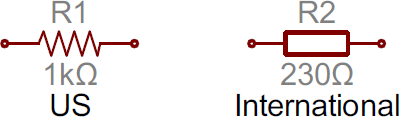|The most fundamental of circuit components and symbols! Resistors on a schematic are usually represented by a few zig-zag lines, with two terminals extending outward. Schematics using international symbols may instead use a featureless rectangle, instead of the squiggles.
|Potentiometers and Variable Resistors|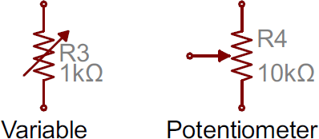|Variable resistors and potentiometers each augment the standard resistor symbol with an arrow. The variable resistor remains a two-terminal device, so the arrow is just laid diagonally across the middle. A potentiometer is a three-terminal device, so the arrow becomes the third terminal (the wiper).
|Capacitors|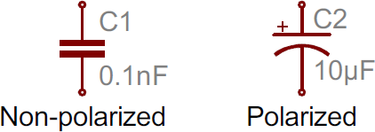|There are two commonly used capacitor symbols. One symbol represents a polarized (usually electrolytic or tantalum) capacitor, and the other is for non-polarized caps. In each case there are two terminals, running perpendicularly into plates. The symbol with one curved plate indicates that the capacitor is polarized. The curved plate usually represents the cathode of the capacitor, which should be at a lower voltage than the positive, anode pin. A plus sign should also be added to the positive pin of the polarized capacitor symbol.
|Inductors|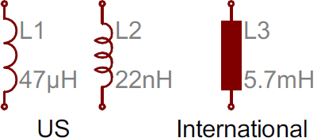|Inductors are usually represented by either a series of curved bumps, or loopy coils. International symbols may just define an inductor as a filled-in rectangle.
|Switches|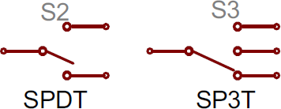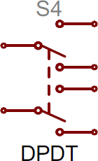|Switches exist in many different forms. The most basic switch, a single-pole/single-throw (SPST), is two terminals with a half-connected line representing the actuator (the part that connects the terminals together). Switches with more than one throw, like the SPDT and SP3T below, add more landing spots for the the actuator. SPDT and SP3T symbolsSwitches with multiple poles, usually have multiple, alike switches with a dotted line intersecting the middle actuator. DPDT symbol
|Power Sources|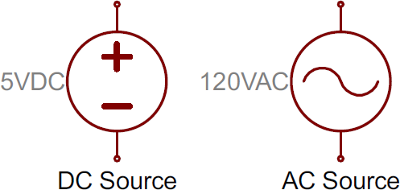|Just as there are many options out there for powering your project, there are a wide variety of power source circuit symbols to help specify the power source. DC or AC Voltage Sources Most of the time when working with electronics, you'll be using constant voltage sources. We can use either of these two symbols to define whether the source is supplying direct current (DC) or alternating current (AC):
|Batteries|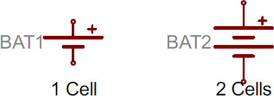|Batteries, whether they're those cylindrical, alkaline AA's or rechargeable lithium-polymers, usually look like a pair of disproportionate, parallel lines: Battery symbols More pairs of lines usually indicates more series cells in the battery. Also, the longer line is usually used to represent the positive terminal, while the shorter line connects to the negative terminal.
|Voltage Nodes|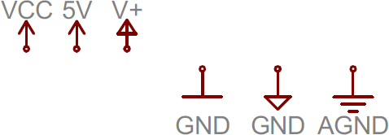|Sometimes -- on really busy schematics especially -- you can assign special symbols to node voltages. You can connect devices to these one-terminal symbols, and it'll be tied directly to 5V, 3.3V, VCC, or GND (ground). Positive voltage nodes are usually indicated by an arrow pointing up, while ground nodes usually involve one to three flat lines (or sometimes a down-pointing arrow or triangle).
|Integrated Circuits|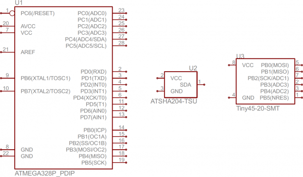|Integrated circuits accomplish such unique tasks, and are so numerous, that they don't really get a unique circuit symbol. Usually, an integrated circuit is represented by a rectangle, with pins extending out of the sides. Each pin should be labeled with both a number, and a function.
|Junctions and Nodes|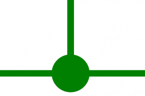|Wires can connect two terminals together, or they can connect dozens. When a wire splits into two directions, it creates a junction. We represent junctions on schematics with nodes, little dots placed at the intersection of the wires. A node: Nodes give us a way to say that "wires crossing this junction are connected". The absences of a node at a junction means two separate wires are just passing by, not forming any sort of connection. (When designing schematics, it's usually good practice to avoid these non-connected overlaps wherever possible, but sometimes it's unavoidable).