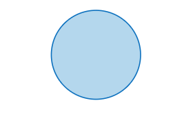
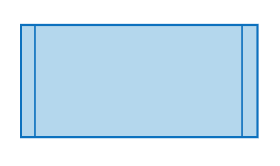
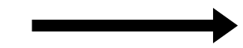

# **Flowchart**
## **What is it?**
A flowchart is a depiction of how a program will run the code written in the program itself, it should describe exactly how the code is handling the different instructions throughout the entire program and should be so descriptive that only using the flowchart you should be able to have anyone writhe the program in their preferred programming langrage.

## **What should it have**
As the name suggests it should show the flow of the program in a more easily readable way, this is done by using shapes lines and descriptions to depict how the code is gonna run, for example a oval shape will indicate the start and end of a program while a diamond shape will indicate a check (if) and due to it having to be readable for anyone theres a few rules thats needed to make it readable for everyone.

## **Shapes and their meaning**

|Name of the shape|Picture of the shape|What it indicates
|:---|:---|:---
|**Oval**||Used to indicate the start and end of a program
|**Rectangle/square**||Used to indicate a action for function being processed
|**Diamond**||Used to indicate a check like a if check, note that there can only be 2 results from a single so if theres more than one thing being checked each option should have their own diamond with either Yes/Right or No/Wrong 
|**Parallelogram**||Used to indicate a user input
|**Circle** ||Used to indicate a state of a program fx a state could be a website with different options depending of if the user is logged in or not, or each state (logged in / not logged in) having their separate options 
|**Rectangle/square with 2 lines**||Used to indicate a separate function/program requeuing their own flowchart to see how it works and what it returns
|**Arrow**||Used to connect everything and show the where the different things are going as well as usually having some text attached to it describing what's needed to go the way the arrow is pointing
